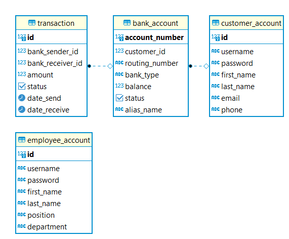
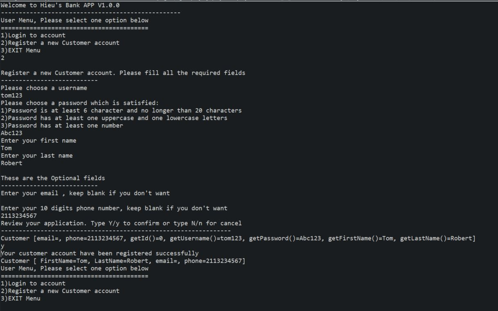

# ROC1-Banking-API

## Executive Summary

The Bank app is a console-based application that simulates banking operations. A customer can apply for an account, view their balance, and make withdrawals and deposits. An employee can approve or deny accounts and view account balances for their customers.

**Activity Diagram**

## Technologies / Dependencies

- Maven build automation tool
- JDBC and Postgres database
- JUnit and code coverage
- Log4j

## Features

1. As a user, I can register and log in for a customer account.
2. As a customer, I can apply for a new bank account with a starting balance
3. As a customer, I can view the balance of a specific account
4. As a customer, I can make a withdrawal or deposit to a specific account
5. As a customer, I can post a money transfer to another account
6. As a customer, I can accept a money transfer from another account
7. System reject invalid transactions: withdrawal a negative balance, deposit or withdrawal of negative money
8. As an employee, I can approve or reject an account
9. As an employee, I can view a customer's bank accounts
10. An employee, I can view a log of all transactions.

## Strech Goals:

- A custom stored procedure is called to perform some portion of the functionality.

## Getting Started

1. Clone the project to your local machine and open it with a Maven Development Tool.
2. Install a Postgres database in local or remoted host(RDS)
3. Config database connecion url, username and password in package: com.bank.dbutil
4. Create database following:

**ER Diagram**

5. Maven Update to build dependencies
6. Go to the BankingMain.java in the main folder and run Java application

## Usage

7. After running, follow the instruction on the console to use the app

## License

MIT
